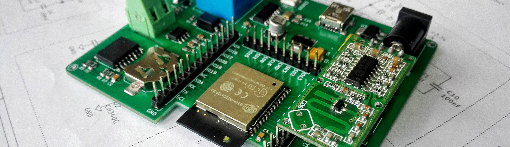

<h1 align="center">Hi, I'm Usman 😃</h1>

I'm an embedded software engineer by profession, working in the Functional
Safety domain. I love building embedded systems, IoT devices and other
software solutions..

I've got 5 years of experience in embedded software, IoT systems, PCB design,
and CAD design. I also develop .NET desktop and backend applications. Recently
I have started writing web apps in JavaScript and mobile apps in Flutter.

I graduated from [Air University Islamabad](https://www.au.edu.pk/) with
a bachelor's degree in Mechatronics Engineering.

```c
summary_t professional_summary(person_t me)
{
    return (summary_t)
    {
        .person              = me,

        .embedded_software   =
        {
            .time            = (years_t)6,
            .catagories      = { BAREMETAL, SECURE_BOOT, OTA, DRIVERS, BLE, MESH },
            .processor_types = { STM32, ESP32, NRF52, HILSCHER },
            .frameworks      = { ZEPHYR, FREE_RTOS, TWINCAT },
            .safety_critical = { IEC_61508, SIL_3 },
            .misra_compliant = true,
            .test_driven     = true,
            .documented      = EXCESSIVELY,
            .languages_used  = { C, CPP, C_SHARP },
            .sometimes_used  = { RUST, JAVASCRIPT, DART },
        },

        .embedded_hardware   = 
        {
            .time            = (years_t)4,
            .catagories      = { POWER, MOTOR_CTRL, AMPS, ENRGY_HARVST, WIRELESS },
            .multilayer_pcbs = true,
            .preferred_eda   = KICAD,
        },

        .mechanical_design   =
        {
            .time            = (years_t)2,
            .catagories      = { ROBOT_CHASSIS, ENCLOSURES, SIMULATIONS, ANIMATIONS, RENDERING },
            .preferred_cad   = { SOLIDWORKS, SW_VISUALIZE, KEYSHOT },
            .wasted_skill    = 
            {
                MATHEMATICAL_MODELING, VIBRATION_ANALYSIS,
                FLUID_ANALYSIS, CONTROL_SYSTEMS, ROBOTICS 
            },
            .regret          = true,
        }
    }
}
```
